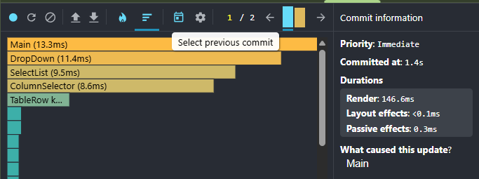
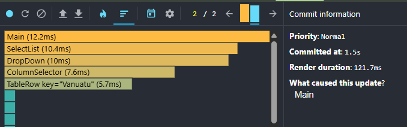
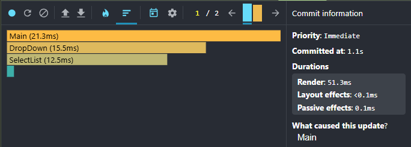
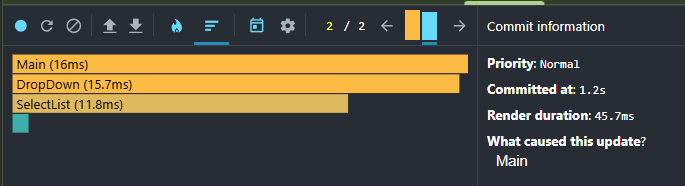

# [React Performance](https://github.com/rolling-scopes-school/tasks/blob/master/react/modules/tasks/performance.md)

Key features in the application includes:

- Fetch and Display Data
  - Fetch CO2 emissions data by countries from a large hierarchical JSON file (~100MB)
  - React Suspense for data loading.
  - List of countries, showing name, population, and ISO code.
  - Modal widget to select additional columns to display from the available yearly data fields.
- Year Selection, Filtering, Sorting, and Search
  - Year selector at the top to choose which year to display for all countries/regions.
  - Filter countries by region using a dropdown menu.
  - Search countries by name using a search bar.
  - Sort countries by population or by name.
- Performance Optimization
  - useMemo to memoize the filtered, searched, and sorted list of countries and selected columns.
  - useCallback to memoize event handler functions for filtering, searching, sorting, and column selection.
  - React.memo to wrap components like country cards and data tables to prevent unnecessary re-renders.
  - Proper key props for lists and tables to avoid reconciliation issues.

## Profiling with React Dev Tools Profiler

The optimization measurement involved sorting the country column in descending order.

### Commit `ece3737d` before optimization done




### Commit `195a5a32` with optimization




First commit rendered 3x faster after optimization: 51.3ms vs 146.6ms.
The second commit shows an improvement in render time, reducing it from 121.7 ms to 45.7 ms.

## Features

- ⚡ [Library for web](https://react.dev/): Built with React 19.
- 🎯 [Build tool](https://vite.dev/): Vite makes web development simple again.
- 💪 [Strongly typed](https://www.typescriptlang.org/): Uses TypeScript.
- 🎊 [CSS Framework](https://picocss.com/): Minimal CSS Framework for semantic HTML.

## Getting Started

### Steps

#### 1. Clone [repository](https://github.com/Sepulator/react-2025q3-nom)

```bash copy
  git clone https://github.com/Sepulator/react-2025q3-nom
```

#### 2. Switch to `performance` branch

```bash copy
  git switch performance
```

#### 3. Open project directory and install dependencies

```bash copy
  npm install
```

#### 4. Start the development server

```bash copy
  npm run dev
```

This command starts the dev server locally `http://localhost:5173/`.

### Available scripts

#### Build for production

```bash copy
  npm run build
```

---

#### Start Vite dev server in the current directory

```bash copy
  npm run dev
```

---

#### Locally preview the production build

```bash copy
  npm run preview
```

---

#### Run ESLint to fix errors

```bash copy
  npm run lint
```

---

#### Run code format with Prettier

```bash copy
  npm run format:fix
```

---

#### Run husky to prepare git hooks

```bash copy
  npm run prepare
```

---
